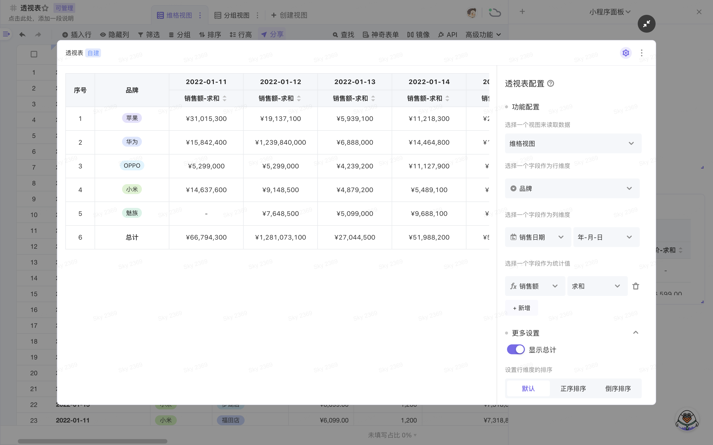

# 维格小程序 - 透视表（Pivot Table）
一款用于数据分类汇总统计的工具，常用于分析、汇报、年度报表等场景。

## 🎨 介绍
**示例图：**

 

**已经实现的功能特性：**
- [x] 支持 1 个行维度、1 个列维度和至多 3 个统计值的展示
- [x] 支持行维度、列维度和值维度的排序
- [x] 支持行维度、列维度的多选值分离
- [x] 支持多种统计方式及汇总统计

 

**正在规划/迭代的功能：**
- [ ] 支持至多 3 个行维度、3 个列维度和 3 个统计值的展示
- [ ] 支持根据筛选条件进行视图数据的筛选
- [ ] 支持同比、环比等统计方式
- [ ] 更丰富的配置项

## 🚀 快速上手
**体验地址：**
为了让大家可以快速体验到这款小程序的用途，这里已经提前做好了一个维格表模板，浏览器打开即可体验：
👉 [戳我体验](https://vika.cn/share/shrZv9w7WzrB1N1GNqbbP)

 

**官方教程：**
想了解更多使用场景和小技巧，可参考官方教程：
👉 [戳我上手](https://vika.cn/help/intro-widget-pivot/)

## 🎯 更新日志
2022-03-20
- 支持 1 个行维度、1 个列维度和至多 3 个统计值的展示

## 😍 更多有趣的维格小程序
如果你喜欢学习、折腾各种维格小程序，可以看看维格官方的宝藏库，里面收集有大量的小程序以及 Vika API 项目：
👉 [awesome-vikadata](https://github.com/vikadata/awesome-vikadata)

PS：如果你也有关于维格表小程序的项目开源，欢迎给我们提交PR，我们会将优秀作品收录到官方宝藏库，独乐乐不如众乐乐😍😍😍